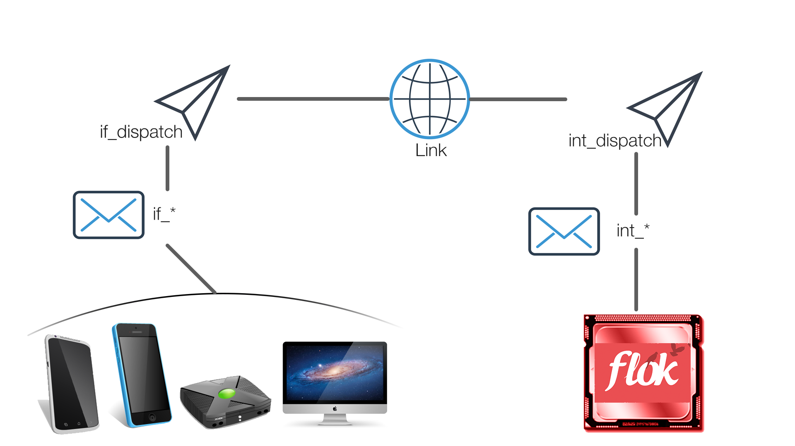

# Architecture
Flok uses a server/client architecture has one two-way communication channel that uses an extremely efficient messaging protocol.  See [Messaging](./messaging.md) for details.

The communications interface is divided up into two parts; interfaces (`if_*`) and interrupts (`int_*`).  Interfaces are going from the flok server to the client.  Interrupts are from the client to the flok server. There is only one real interface and only one real interrupt, these are `int_dispatch` and `if_dispatch`.  All the other interrupts and interfaces are `virtual` as in they are decoded via the flok server `int_dispatch` or for each platform, `if_dispatch` decodes their messages.

