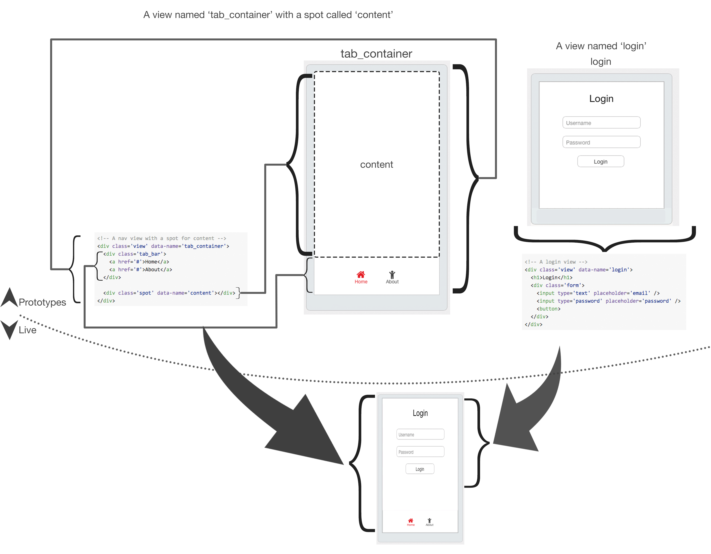

#Persist (persist.js)
Persistance management. Storage of data, etc.  Loosely based on redis.  Refer to [redios.io](http://redis.io/commands) for more detailed
descriptions.

###Messages
`if_per_hdel key field [field...]` - Delete one or more hash fields
`if_per_hmget key field [field...]` - Get the value of multiple fields

###Spec related
`if_ui_spec_init` - Setup anything necessary for the spec tests, this may include adding prototype views to your hierarchy, etc.
`if_ui_spec_views_at_spot(p)` - Sends a packet back that contains a listing of all the view pointers inside of a spot. If 0 is passed, the view pointers are from the root node. `[N(vp*), "spec", vp*]`
`if_ui_spec_view_exists(vp)` - Checks whether or not a view still exists `[1, "spec", true]`
`if_ui_spec_view_is_visible(vp)` - Checks whether or not a view is visible `[1, "spec", true]`

#####You must be able to accept the following prototypes names:
`spec_blank` - A blank view with no spots
`spec_one_spot` - "A blank view with with one spot named `content` that takes up the entire view"
`spec_two_spot` - "A blank view with with one spot named `a` and one spot named `b`.

------

## Overview 

This driver controls two things called a **view** and a **spot**. 

 1. **View** - A **view** holds your content.
 2. **Spot** - Views can have blank **Spot**s where other views can be placed.

## Examples
Here is an example for the `chrome` driver of a live view built from two views.

###A note on free
If `free` is called on a view, that view is always already detached. If a *view* receives `free`, that *view* must call `free` on all of it's children before itself.
