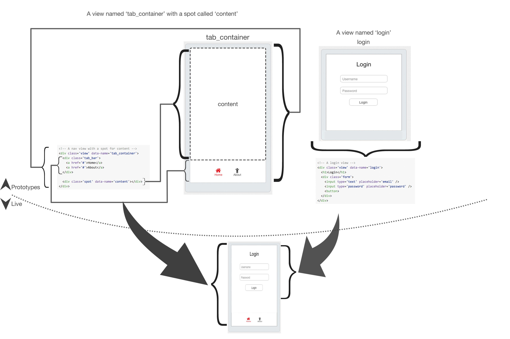

#User Interface (ui.js)

###Functions

`if_init_view(name, info, tp_base, tp_targets)` - Create a view based on an agreed upon name for a `prototype` and pass it some `info`. Do not show the view yet.  `tp_targets` will look like `["main", "contentA", ...]` where everything after `root` is a spot.
```js
(main)>if_init_view('nav_container', {title: "Home"}, 333, ["root", "content"]);
```

`if_free_view(vp)` - Destroy a view with a `view pointer`.

`if_attach_view(vp, p)` - A request to embed a view (`vp`) into the top of a view or spot located at `vp`|`sp` provided during `if_init_view`. If `p` is a `view pointer`, then `vp` is placed **ontop** of `p`.  If `p` is a `spot pointer`, then `vp` is placed **inside** of `p`.  If *p* is 0, then you should place this **inside** of the root view.

###Spec related
`if_ui_spec_init` - Setup anything necessary for the spec tests, this may include adding prototype views to your hierarchy, etc.
`if_ui_spec_views_at_spot(p)` - Sends a packet back that contains a listing of all the view pointers inside of a spot. If 0 is passed, the view pointers are from the root node. `[N(vp*), "spec", vp*]`
`if_ui_spec_view_exists(vp)` - Checks whether or not a view still exists `[1, "spec", true]`
`if_ui_spec_view_is_visible(vp)` - Checks whether or not a view is visible `[1, "spec", true]`

#####You must be able to accept the following prototypes names:
`spec_blank` - A blank view with no spots
`spec_one_spot` - "A blank view with with one spot named `content` that takes up the entire view"
`spec_two_spot` - "A blank view with with one spot named `a` and one spot named `b`.

#####Additionally, if you're UI implementation has typical semantics, add the `ui_typical_extra_specs` to your defines section of the config.yml
`spec_blank_sends_context` - A view with no spots that sends back the context it receives with the event name `context`. This should be placed in the *initializer* like area.

------

## Overview 

This driver controls two things called a **view** and a **spot**. 

 1. **View** - A **view** holds your content.
 2. **Spot** - Views can have blank **Spot**s where other views can be placed.

## Examples
Here is an example for the `chrome` driver of a live view built from two views.


###A note on free
If `free` is called on a view, that view is always already detached. If a *view* receives `free`, that *view* must call `free` on all of it's children before itself.
Additionally, any controllers bound to the *view* via `if_controller_init` must be destroyed as well.
