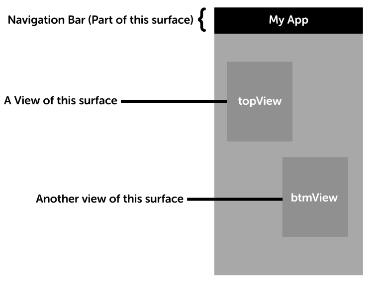

#User Interface (ui.js)

###Functions

`if_init_surface(name, info)` - Create a surface based on an agreed upon name for a `prototype` and pass it some `info`. Do not show the surface yet.  Returns a hash containing  a key called `sp` with a `surface pointer` and any named views will need to have the required keys as the view's name in the key and the value will be a pointer to that view.

`if_free_surface(sp)` - Destroy a surface with a `surface pointer`.

`if_detach_surface(sp)` - Remove a surface from it's current view

`if_attach_surface(sp, vp)` - A request to embed a surface (`sp`) into the top of a view located at `vp` provided during `if_init_surface`.

------

### Overview 

This driver controls the **semantics** of the visuals shown on screen.  There is no defined layouts, styles, or anything relating to rendering. There is however, a hierarchy description composed of two elements:

 1. **View**
 2. **Spot**

---------------------------------------------------------------------------

###View
A view holds your content.

###Spot
Views can have blank **spot**s where other views can be placed.
---------------------------------------------------------------------------

Here is an *analougy* in HTML. **This is not the way it's actually defined, the code here is never actually used in flok, but something similar is**
```html
<!-- A login view -->
<div class='view' data-name='login'>
  <h1>Login</h1>
  <div class='form'>
    <input type='text' placeholder='email' />
    <input type='password' placeholder='password' />
    <button>
  </div>
</div>
```

```html
<!-- A nav view with an area for content -->
<div class='view' data-name='nav_container'>
  <div class='nav_bar'>
    <a href='#'>Home</a>
    <a href='#'>About</a>
  </div>
  
  <div class='spot' data-name='content'></div>
</div>
```

###Views
Views are *only* embedded within a surface.  You can have one view, one hundred views, or zero views within a `Surface`. Now you might be asking yourself,
wait, I thought you just said a *surface* is embedded in a *surface*, and now you're saying that a *view* is embedded within a *surface*?.

Yes, you read that correctly. A `View` only represents a blank area in a `Surface`; when you embed one `surface` in another `surface` you *must* say *where*. The *where*
is answered by the *view*.

Here's a concrete example to clear any remaining confusion.



In this diagram, you are seeing something akin to a `Navigation` controller that has a permanent navigation bar at the top. Inside this surface, there are two views named `topView`, and `btmView`.
This surface can then accept two sub-surfaces in those two views.


###A note on free and remove
The `if_free_surface` must always be preceeded by a `if_detach_surface` if the surface is already attached. Failure to do so is undefined.
Additionally, `detach` and `free` will only be called on the root of the hierarchy and should effect all children. Most platforms have a reference
counting implementation that can handle this, like `ARC` on iOS and the `DOM` on HTML5. For other platforms, there is planned support for a compilation
hint that will shim this driver to automatically destroy and detach surfaces in reverse hierarchical order.
