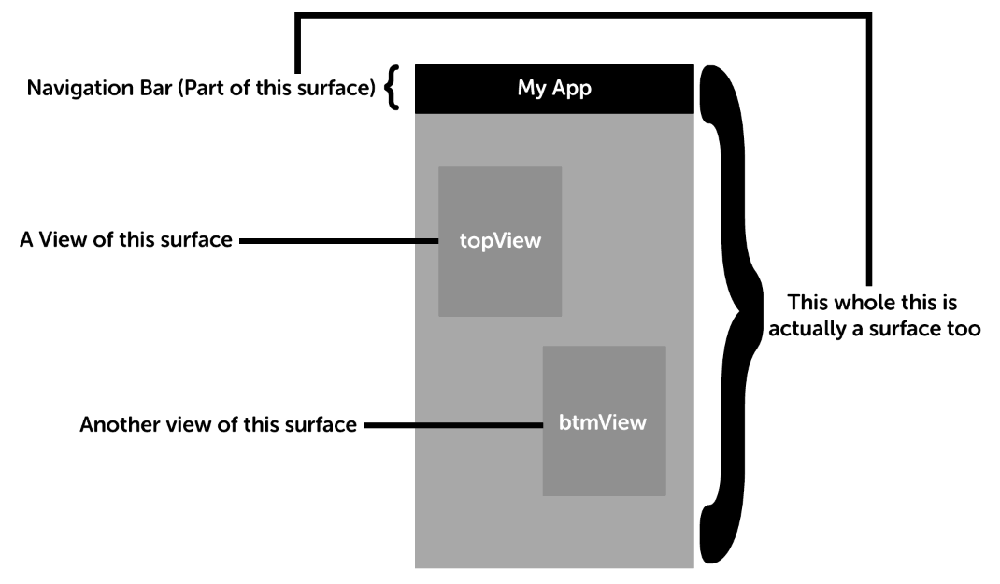

#User Interface (ui.js)

###Functions

------

`if_init_surface(name, info)` - Create a surface based on an agreed upon name for a `prototype` and pass it some `info`. Do not show the surface yet.  Returns a `surface pointer`, abbreviated as `sp`.  A `surface pointer` is an opaque type that is platform defined.

`if_free_surface(sp)` - Destroy a surface with a `surface pointer`.

`if_embed_surface(source_sp, dest_sp, view_name, animated, animationDidComplete)`

This driver controls the **semantics** of the visuals shown on screen.  There is no defined layouts, styles, or anything relating to rendering. There is however, a hierarchy description composed of two elements:

 1. Surfaces
 2. Views

###Surfaces
A `Surface` is somewhat analagous to View Controller's from iOS® with the exception that sa surface is embedded within other surfaces.

###Views
Views are *only* embedded within a surface.  You can have one view, one hundred views, or zero views within a `Surface`. Now you might be asking yourself,
wait, I thought you just said a *surface* is embedded in a *surface*, and now you're saying that a *view* is embedded within a *surface*?.

Yes, you read that correctly. A `View` only represents a blank area in a `Surface`; when you embed one `surface` in another `surface` you *must* say *where*. The *where*
is answered by the *view*.

Here's a concrete example to clear any remaining confusion.

In this diagram, you are seeing something akin to a `Navigation` controller that has a permanent navigation bar at the top. Inside this surface, there are two views named `topView`, and `btmView`.
This surface can then accept two sub-surfaces in those two views.

###Communication back to floc kernel
Each surface has a communication pipe connected to the kernel. For a typical user initiated event, like a button tap or gesture detection, the surface controller (platform defined), will notify that platform's `ui` driver that an event has occurred and pass a valid `surface pointer` for the event.  Flok will then receive the `surface pointer` through the `pipe` subsystem and redirect the message to the `sc` subsystem (Surface Controller).
